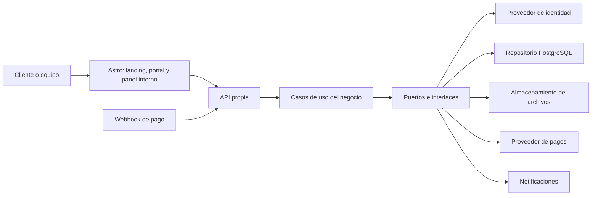
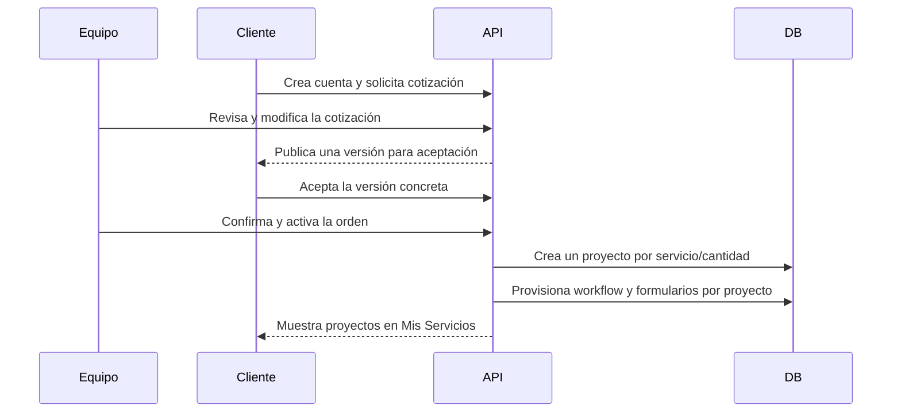

# Arquitectura del sistema División Digital

**Estado:** arquitectura aprobada; infraestructura de datos implementada
**Fecha:** 2026-07-27
**Última actualización:** 2026-07-29

## 1. Objetivo

Evolucionar la landing pública actual hacia una plataforma para gestionar el ciclo completo de prestación de servicios:

1. El cliente crea una cuenta y puede consultar su perfil y cotizaciones.
2. Solicita una cotización para uno o varios servicios del catálogo.
3. El equipo revisa, modifica, aprueba o rechaza la propuesta desde el panel interno.
4. El cliente acepta una versión concreta de la cotización.
5. Un administrador confirma la cotización aceptada y activa la contratación.
6. El sistema crea una instancia/proyecto independiente por cada servicio y cantidad contratada.
7. El sistema provisiona automáticamente los formularios, workflow y configuración de cada proyecto.
8. El cliente consulta sus proyectos, completa formularios, entrega archivos y observa avances.
9. El equipo gestiona proyectos, estados, hitos, archivos, solicitudes y comunicaciones desde un dashboard central.

Los pagos automáticos serán una integración futura. Cuando exista un proveedor, su webhook podrá confirmar el pago y dejar la orden elegible para activación, pero no reemplazará la acción autorizada del administrador ni creará proyectos desde el navegador.

## 2. Principios arquitectónicos

- Mantener Astro como frontend principal.
- Conservar la landing pública como contenido estático siempre que sea posible.
- Habilitar renderizado bajo demanda solo para rutas autenticadas o personalizadas.
- Separar presentación, casos de uso, dominio y proveedores de infraestructura.
- Construir un monolito modular antes de considerar microservicios.
- Exponer una API propia entre el frontend y el backend.
- No llamar directamente a proveedores desde los componentes de UI.
- Mantener contratos y tipos compartidos.
- Tratar la seguridad como una propiedad del backend y la base de datos, no de la interfaz.
- Encapsular proveedores actuales para facilitar una futura migración a AWS.
- Documentar cada decisión y cambio significativo.

## 3. Componentes principales



### Frontend Astro

El proyecto Astro contendrá tres áreas con layouts independientes:

- **Landing pública:** `/`, servicios, portafolio, contacto y contenido comercial.
- **Portal del cliente:** `/app`, autenticación, servicios contratados, formularios, archivos y progreso.
- **Panel del equipo:** `/equipo`, clientes, cotizaciones, pagos, solicitudes, estados y auditoría.

La matriz vigente de actores, alcances y permisos se mantiene en [`seguridad/matriz-permisos.md`](./seguridad/matriz-permisos.md). Durante el MVP, Equipo y Admin comparten la operación diaria, pero solo Admin tiene la capability `activate_projects`.

Astro está configurado en modo `server` con el adapter de Cloudflare. La landing `/` permanece prerenderizada y las rutas privadas futuras usarán renderizado bajo demanda y cookies de sesión. Los componentes interactivos podrán organizarse como Islands; React será opcional para widgets con estado complejo.

La integración Supabase separa tres clientes: navegador con publishable key para Auth/Storage autorizado; SSR creado por petición para validar sesión y escribir cookies; y cliente privilegiado dentro de `src/server`, sin persistencia de sesión y con secret key disponible únicamente en Workers.

### Backend modular

El backend se organizará como un monolito modular con separación hexagonal:

```text
src/server/
├── domain/        Entidades, estados y reglas puras del negocio
├── application/   Casos de uso y orquestación
├── ports/         Interfaces para DB, identidad, pagos, archivos y notificaciones
├── adapters/      Implementaciones de Supabase, Cloudflare u otros proveedores
├── modules/       auth, clients, quotes, orders, payments, catalog, projects, forms, files...
└── http/          Endpoints, serialización y manejo de errores
```

La lógica de dominio no deberá importar SDKs de Supabase, Cloudflare o AWS.

#### Agregados y casos de uso principales

Los agregados del dominio deben representar reglas, no tablas crudas:

- `Quote`: solicitud, versiones, vigencia y aceptación de una cotización.
- `Order`: snapshot de la versión aceptada y elegibilidad de activación.
- `Project`: una contratación concreta de un servicio y una unidad.
- `ProjectForm`: formulario provisionado para un proyecto y su estado de edición.
- `WorkflowDefinition`: estados, transiciones y capabilities permitidas por servicio.

Los casos de uso iniciales serán:

```text
RegisterClient
CreateQuoteRequest
PublishQuoteVersion
AcceptQuoteVersion
ConfirmOrder
ActivateOrder                 # solo capability activate_projects/admin
SaveProjectFormDraft
SubmitProjectForm
TransitionProject
CreateFileUploadIntent
ProcessPaymentWebhook         # futuro; no activa proyectos
```

`ActivateOrder` es el punto único de provisionamiento: recibe una orden real, verifica autorización y precondiciones, crea un `Project` por ítem/unidad, instancia sus formularios y registra eventos/auditoría. La UI no podrá crear directamente proyectos ni formularios.

Los puertos mínimos serán `IdentityProvider`, `OrganizationRepository`, `QuoteRepository`, `OrderRepository`, `ProjectRepository`, `CatalogRepository`, `FormRepository`, `FileStorage`, `PaymentProvider`, `NotificationSender`, `AuditWriter` y `OutboxPublisher`. Los casos de uso dependerán de estas interfaces y devolverán DTOs versionados, nunca filas crudas ni objetos SDK.

## 4. Módulos de negocio iniciales

- `auth`: sesiones, invitaciones, recuperación y usuario actual.
- `organizations`: empresas, clientes y membresías.
- `payments`: intentos, confirmación e idempotencia; no activa proyectos por sí solo.
- `services/catalog`: servicios configurables, formularios requeridos y workflows versionados.
- `quotes`: solicitudes, versiones negociadas, aceptación y rechazo.
- `orders`: snapshot comercial aceptado y elegibilidad de activación.
- `projects`: instancia concreta de un servicio contratado, una por ítem/cantidad.
- `forms`: plantillas versionadas, instancias automáticas por proyecto, respuestas y validaciones.
- `milestones`: hitos, progreso e historial por proyecto.
- `files`: archivos privados, permisos y URLs temporales.
- `messages`: comunicaciones cliente-equipo.
- `notifications`: correo, WhatsApp y recordatorios.
- `audit`: historial de acciones relevantes.

## 5. Modelo de datos conceptual

La decisión detallada está documentada en [`datos/modelo-relacional.md`](./datos/modelo-relacional.md), el inventario lógico en [`datos/modelo-mvp.md`](./datos/modelo-mvp.md) y la implementación verificable en [`datos/modelo-fisico-supabase.md`](./datos/modelo-fisico-supabase.md). El MVP usa PostgreSQL 17 relacional multi-tenant con `organization_id` y RLS, JSONB controlado para formularios versionados, historial append-only y object storage privado para archivos.

```text
organizations
└── organization_members
    └── profiles

staff_members
└── profiles/auth.users

quotes
└── quote_versions
        └── quote_version_items
        └── orders
                ├── order_items
                └── payments

service_catalog
├── service_workflow_versions
├── form_templates
│   └── form_versions
└── projects (service_instances)
    ├── project_forms
    │   └── form_response_revisions
    ├── milestones
    ├── project_events
    ├── attachments
    └── messages
```

La entidad de dominio `Project` representa una contratación concreta de un servicio por una organización. La tabla física propuesta es `service_instances` para conservar compatibilidad con la documentación existente. Cada ítem y unidad de una orden genera un proyecto distinto, incluso si el catálogo apunta al mismo servicio. No se creará una implementación distinta para cada servicio: se reutilizarán configuración, formularios, estados, hitos y archivos versionados.

La activación debe ejecutarse mediante un caso de uso transaccional `ActivateOrder`, autorizado únicamente para `admin`. Ese caso de uso crea los proyectos y sus formularios a partir de la versión aceptada de la orden; la creación es idempotente mediante una clave por `order_item_id` y unidad contratada.

## 6. Flujo de activación de proyectos



Los pagos manuales y automáticos quedan separados de la activación. Un pago futuro podrá dejar la orden en estado elegible o bloqueada según la política comercial; la activación seguirá pasando por `ActivateOrder` y registrará al administrador, fecha y motivo. Si el negocio decide automatizar también esa autorización, se añadirá una capacidad explícita sin cambiar las entidades ni los puertos.

## 7. Seguridad base

- Todas las operaciones privadas requieren sesión válida.
- Los permisos se validan por organización, servicio y rol.
- El cliente nunca puede activar su propio servicio.
- Solo un administrador puede ejecutar la activación de una orden.
- Cada ítem/cantidad activa un proyecto independiente.
- Los formularios se instancian automáticamente desde la configuración publicada del servicio.
- Los webhooks futuros se validan, registran y procesan de forma idempotente, pero no conceden acceso por sí solos.
- Las claves secretas solo existen en el servidor.
- Los archivos de clientes se guardan en almacenamiento privado.
- Las URLs de descarga tendrán expiración limitada.
- Todas las entradas se validan en servidor con esquemas tipados.
- Se registran acciones sensibles en `audit_events`.
- La autorización no dependerá de datos editables por el usuario.
- Toda tabla expuesta a la API deberá tener políticas de acceso revisadas.

## 8. Portabilidad hacia AWS

Los puertos principales serán:

```ts
AuthProvider
DatabaseRepository
FileStorage
PaymentProvider
NotificationProvider
JobQueue
```

Las implementaciones iniciales pueden usar Supabase y Cloudflare. En una futura migración se podrán sustituir por Cognito, RDS/Aurora PostgreSQL, S3, SES, SQS o EventBridge sin modificar los casos de uso principales.

El frontend consumirá la API propia y no el Data API de un proveedor directamente. La única excepción deliberada es la proyección pública de seis columnas de `service_catalog`; Auth y cargas autorizadas de Storage usan sus APIs específicas. Esta decisión reduce el acoplamiento y mantiene estable la interfaz del sistema.

## 9. Límites de esta decisión

Esta arquitectura no implica comenzar con AWS ni con microservicios. La primera versión debe optimizar la validación del flujo comercial y operativo. La migración a AWS se evaluará cuando exista una necesidad concreta de escala, integración corporativa, cumplimiento o infraestructura.

## 10. Referencias

- [Estado técnico actual](./informe-analisis-inicial.md)
- [Roadmap del proyecto](./roadmap.md)
- [ADR-001: Astro híbrido](./decisiones/ADR-001-astro-hibrido.md)
- [ADR-002: Backend modular y portable](./decisiones/ADR-002-backend-portable.md)
- [ADR-003: Activación administrativa y pagos desacoplados](./decisiones/ADR-003-activacion-pago.md)
- [ADR-004: Modelo relacional multi-tenant](./decisiones/ADR-004-modelo-relacional-multitenant.md)
- [ADR-005: Proyectos por servicio y formularios configurables](./decisiones/ADR-005-proyectos-por-servicio-y-formularios-configurables.md)
- [ADR-006: Autoridad interna separada](./decisiones/ADR-006-autoridad-interna-separada.md)
- [Modelo relacional del portal](./datos/modelo-relacional.md)
- [Modelo de datos inicial del MVP](./datos/modelo-mvp.md)
- [Modelo físico Supabase/PostgreSQL](./datos/modelo-fisico-supabase.md)
- [RLS, grants y Storage](./seguridad/rls-supabase.md)
- [Flujo funcional del backend](./backend-flow.md)
- [Modelo de dominio](./domain-model.md)
- [Casos de uso](./use-cases.md)
- [Convenciones](./conventions.md)
- [Diseño conceptual de API](../docs/api-design.md)
