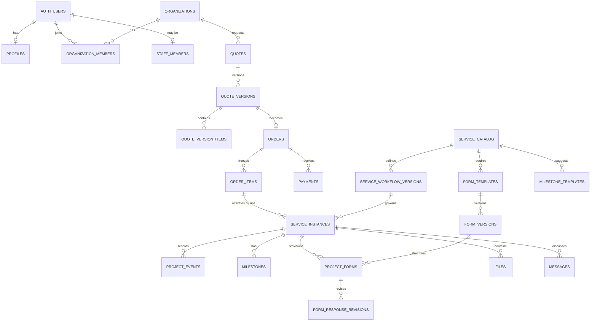

# Modelo físico Supabase/PostgreSQL

**Estado:** implementado y validado en desarrollo
**Fecha:** 2026-07-28
**Última validación remota:** 2026-07-29
**Proyecto remoto:** `division-digital-dev` (`drvvtxbvgpygvcvqqofd`)
**Región:** São Paulo (`sa-east-1`)
**Motor:** PostgreSQL 17

## 1. Alcance implementado

Esta implementación contiene únicamente infraestructura de datos: esquema PostgreSQL, integración con Supabase Auth, Storage privado, RLS, grants, seed, pruebas y documentación. No implementa endpoints ni casos de uso backend.

La fuente de verdad versionada está en `supabase/migrations/`. El proyecto de desarrollo remoto se usa para validación porque el equipo no dispone de Docker, `psql` ni Supabase CLI global. La CLI está fijada en el repositorio como `supabase@2.110.0`.

El cierre de la infraestructura fue revalidado directamente contra el proyecto remoto: 18 migraciones alineadas, 28 tablas públicas con RLS, 34 políticas públicas y 2 políticas sobre `storage.objects`, seed intacto, 62/62 pruebas pgTAP y Security Advisor sin hallazgos.

## 2. Convenciones físicas

- Claves de negocio `uuid`; identidades referencian `auth.users(id)`.
- Fechas y auditoría en `timestamptz`; fechas civiles puntuales en `date`.
- Importes en `numeric(12,2)` y moneda ISO-4217 en tres letras; `COP` es el valor predeterminado.
- Estados cerrados con `CHECK`, salvo `service_instances.status_code`, que pertenece al workflow versionado.
- JSONB solo para definiciones, snapshots, respuestas y metadata acotada; ownership, estados, importes y relaciones siguen siendo columnas.
- FKs con acción de borrado explícita. La evidencia comercial y operativa usa principalmente `RESTRICT`; la identidad derivada puede usar `CASCADE` o `SET NULL`.
- Recursos tenant-scoped conservan `organization_id`; las rutas críticas usan FKs compuestas para impedir relaciones entre tenants.
- Borrado lógico mediante estado y timestamps. No existen cron jobs de purga.

## 3. Diccionario de tablas

| Área | Tabla | Propósito e invariantes principales |
|---|---|---|
| Identidad | `profiles` | Perfil de presentación 1:1 con `auth.users`; no almacena roles. |
| Identidad | `organizations` | Tenant cliente; estados `active`, `suspended`, `archived`. |
| Identidad | `organization_members` | Membresía cliente `owner` o `member`; única por organización/usuario. |
| Identidad | `organization_invitations` | Invitaciones de tenant; nunca concede autoridad global. |
| Personal | `staff_members` | Autoridad interna global `team` o `admin`; separada de clientes. |
| Personal | `staff_invitations` | Invitaciones internas; solo `admin` puede administrarlas mediante la futura API. |
| Catálogo | `service_catalog` | Servicio versionado y publicable; `slug` único. |
| Catálogo | `service_workflow_versions` | Definición JSONB del workflow; una versión publicada es inmutable. |
| Catálogo | `form_templates` | Identidad estable de un formulario por servicio. |
| Catálogo | `form_versions` | Definición y esquema de validación versionados; publicación inmutable. |
| Catálogo | `milestone_templates` | Hitos iniciales ordenados y reutilizables. |
| Comercial | `quotes` | Solicitud de cotización por organización e idempotencia opcional por creador. |
| Comercial | `quote_versions` | Snapshot monetario congelado; total comprobado por constraint. |
| Comercial | `quote_version_items` | Servicio, versión, cantidad, alcance y precios congelados por línea. |
| Comercial | `orders` | Acuerdo derivado de una versión aceptada y estado de activación. |
| Comercial | `order_items` | Snapshot de cada línea que será provisionada. |
| Pagos | `payments` | Intentos/confirmaciones, referencia externa idempotente e importe. |
| Pagos | `webhook_events` | Recepción idempotente por proveedor/evento; payload y estado de proceso. |
| Operación | `service_instances` | Persistencia de `Project`; servicio, workflow y snapshots fijados. `UNIQUE(order_item_id, unit_number)`. |
| Operación | `project_events` | Historial append-only de eventos y transiciones. |
| Operación | `milestones` | Hitos concretos del proyecto, con visibilidad cliente. |
| Formularios | `project_forms` | Instancia de formulario ligada a plantilla y versión inmutables. |
| Formularios | `form_response_revisions` | Respuestas versionadas append-only; revisión única por formulario. |
| Archivos | `files` | Metadata, tenant, proyecto, MIME, tamaño, checksum y ruta de Storage. |
| Comunicación | `messages` | Mensajes de proyecto con visibilidad `client` o `internal`. |
| Plataforma | `notifications` | Notificaciones por usuario con estado de lectura/archivo. |
| Plataforma | `audit_events` | Evidencia append-only de acciones sensibles, sin secretos. |
| Plataforma | `outbox_events` | Eventos externos reintentables con `attempts` y `available_at`. |

## 4. Relaciones principales



## 5. Estados

- Organizaciones: `active`, `suspended`, `archived`.
- Membresías: `invited`, `active`, `suspended`, `revoked`.
- Staff: `active`, `suspended`, `revoked`.
- Invitaciones: `pending`, `accepted`, `revoked`, `expired`.
- Catálogo: `draft`, `published`, `archived`; versiones: `draft`, `published`, `retired`.
- Cotizaciones: `pending_review`, `draft`, `published`, `accepted`, `rejected`, `expired`, `cancelled`.
- Versiones de cotización: `draft`, `published`, `superseded`, `accepted`, `rejected`, `expired`.
- Órdenes, pagos, archivos, mensajes, notificaciones, webhooks y outbox tienen catálogos cerrados declarados en sus migraciones.
- Formularios de proyecto: `pending`, `open`, `submitted`, `changes_requested`, `locked`.
- Hitos: `pending`, `in_progress`, `completed`, `cancelled`.
- Workflow inicial de proyecto: `pending → awaiting_client_information → information_received → in_progress → in_review → corrections → completed → archived`.

El workflow define las transiciones válidas. La columna `service_instances.status_code` permite filtrar y ordenar sin desnormalizar la definición completa.

## 6. Automatizaciones deliberadamente limitadas

Los triggers implementados:

- crean el perfil cuando Supabase Auth inserta un usuario;
- mantienen `updated_at`;
- impiden cambiar el tenant de recursos existentes;
- hacen inmutables las versiones publicadas y snapshots comerciales;
- hacen append-only las revisiones, eventos y auditoría.

No se implementan en triggers la creación de organizaciones, aceptación/publicación, activación, validación semántica de formularios, despacho de outbox ni proceso de webhooks. Esas operaciones requieren futuros casos de uso transaccionales en la API.

## 7. Migraciones

Las 18 migraciones se aplicaron en orden y el historial remoto coincide con los archivos locales:

1. `create_foundation_schemas`
2. `create_identity_and_organizations`
3. `create_staff_authority_and_invitations`
4. `create_service_catalog_and_templates`
5. `create_quotes_and_versions`
6. `create_orders_payments_and_webhooks`
7. `create_projects_events_and_milestones`
8. `create_project_forms_and_revisions`
9. `create_files_messages_and_notifications`
10. `create_audit_and_outbox`
11. `create_integrity_functions_and_triggers`
12. `create_query_indexes`
13. `create_rls_grants_and_storage_policies`
14. `allow_namespaced_project_event_types`
15. `add_foreign_key_covering_indexes`
16. `harden_data_api_privileges`
17. `enforce_commercial_and_project_immutability`
18. `harden_project_files_upload_policies`

Las cinco últimas son correcciones incrementales: eventos namespaced, cobertura de FKs, allowlist del Data API, congelación completa de snapshots y políticas de subida realistas. No deben compactarse después de haber sido aplicadas.

## 8. Seed

`supabase/seed.sql` es idempotente y contiene:

- servicio público publicado **Landing Page**;
- workflow v1 publicado con ocho estados;
- formulario **Briefing de negocio**;
- formulario **Contenidos e identidad**;
- tres hitos iniciales.

No contiene usuarios, PII, pagos, tokens ni secretos. El seed se ejecutó dos veces sin duplicados. No se debe ejecutar en producción salvo decisión explícita y revisión del catálogo.

## 9. Índices y consultas

Existen índices para:

- membresías activas y helpers RLS;
- colas de cotizaciones, órdenes, proyectos, formularios, pagos, webhooks y outbox;
- relaciones usadas por políticas;
- claves foráneas simples y compuestas;
- idempotencia comercial y externa.

El plan del dashboard de proyectos usa `service_instances_org_status_updated_idx`. El Performance Advisor no reporta FKs sin índice; solo informa índices todavía no usados, algo esperado en una base de desarrollo sin carga representativa. No deben eliminarse hasta medir un workload real con `EXPLAIN (ANALYZE, BUFFERS)`.

## 10. Límites operativos

- Bucket privado `project-files`.
- Tamaño máximo por objeto: 25 MiB.
- MIME permitidos: PDF, JPEG, PNG y WebP.
- HTML, SVG y ejecutables no están permitidos.
- La ruta del objeto y la fila `files` deben ser creadas por servidor; no existe `upsert` genérico.
- No hay proveedor de pagos, workers, cron, entrega de outbox ni limpieza automática.
- No hay particiones. Se revisarán solo con volumen real.
- La retención física y backups de producción dependen de una política legal/operativa aún pendiente.
- No existen vistas públicas. Cualquier vista futura deberá usar `security_invoker`.

## 11. Validación ejecutada

- 28 tablas públicas y 28 con RLS.
- 34 políticas en `public` y 2 sobre `storage.objects`.
- Cero grants de tabla para `anon` y `authenticated`; existen 12 grants de columna, equivalentes a las seis columnas públicas de `service_catalog` para cada rol.
- `anon` y `authenticated` solo tienen `SELECT` sobre `id`, `slug`, `name`, `description`, `version` y `published_at`, condicionado a catálogo publicado/público.
- Cero vistas públicas y cero funciones `SECURITY DEFINER` en el schema `public`.
- El schema privado contiene 7 funciones privilegiadas para Auth/RLS/Storage y 12 funciones de trigger sin `SECURITY DEFINER`; todas fijan `search_path` vacío.
- `service_role` no tiene `DELETE`, `TRUNCATE`, `TRIGGER` ni `REFERENCES` sobre tablas públicas.
- Pruebas pgTAP: 8 de esquema, 17 de RLS/Storage, 19 de invariantes y 18 de hardening; 62/62 aprobadas.
- Simulación de cliente A, cliente B, `team` y `admin`; aislamiento y separación de autoridad aprobados.
- Inmutabilidad, append-only, importes, cantidades y duplicado `(order_item_id, unit_number)` probados.
- Security Advisor sin hallazgos.
- Performance Advisor sin FKs no indexadas; permanecen avisos informativos de índices sin uso.
- Prueba HTTP de Storage aprobada para autorización, expiración, MIME, tamaño, `upsert`, estado y visibilidad; fixtures eliminados.
- Reejecución posterior de las cuatro suites dentro de transacciones con `ROLLBACK`; no quedaron usuarios `.example.test` ni datos temporales.

La repetición local futura requiere Docker:

```powershell
corepack pnpm@10.28.1 exec supabase db reset
corepack pnpm@10.28.1 exec supabase test db
```

En producción se aplican exactamente estas migraciones mediante el pipeline de despliegue; nunca se edita el esquema manualmente ni se usa el seed de prueba.

## 12. Historial de implementación

La construcción se realizó en tres etapas incrementales:

1. **Modelo base (migraciones 1–13):** schemas, identidad, organizaciones, staff, catálogo, cotizaciones, órdenes, pagos, proyectos, formularios, archivos, auditoría, constraints, triggers, índices, RLS y Storage.
2. **Correcciones de integridad (migraciones 14–15):** eventos con nombres namespaced y cobertura de índices para todas las claves foráneas relevantes.
3. **Endurecimiento previo al backend (migraciones 16–18):** allowlist del Data API, default ACL restrictiva, owner defensivo, snapshots e identidades inmutables y flujo realista de subida pendiente a Storage.

Cada etapa se aplicó mediante migraciones nuevas. No se reescribieron migraciones que ya formaban parte del historial remoto.

## 13. Promoción y control de cambios

- Desarrollo es el único entorno remoto utilizado hasta ahora.
- Staging y producción deberán crearse desde cero aplicando las mismas 18 migraciones, en el mismo orden.
- `seed.sql` es catálogo demostrativo de desarrollo y no se promueve automáticamente.
- Toda migración nueva debe incluir constraints, índices, RLS/grants y pruebas en el mismo cambio.
- Antes de promover: comparar historial local/remoto, ejecutar pgTAP, revisar Advisors, probar consultas principales y documentar rollback/compatibilidad.
- No ejecutar DDL desde el Dashboard como sustituto de una migración.
- No eliminar índices marcados como “sin uso” hasta contar con carga y planes representativos.
- La configuración Auth, secretos, SMTP, Turnstile, backups y restricciones de red se administra por entorno y no debe codificarse como datos del seed.
