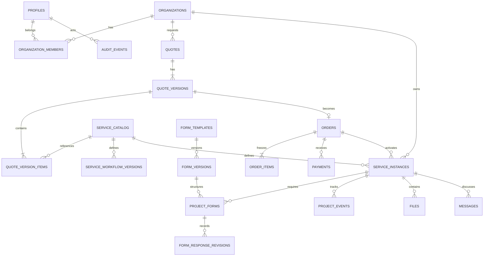

# Modelo relacional del portal

**Estado:** decisión implementada en Supabase/PostgreSQL
**Fecha:** 2026-07-28
**Propietario:** equipo de desarrollo
**Relacionado:** [ADR-004: modelo relacional multi-tenant](../decisiones/ADR-004-modelo-relacional-multitenant.md), [modelo físico](./modelo-fisico-supabase.md)

## 1. Propósito

Este documento convierte la investigación sobre modelos de datos en una decisión aplicable al portal de División Digital. El sistema debe conservar la landing actual, permitir que un cliente se registre antes de contratar, y añadir un portal privado y un panel interno para gestionar cotizaciones, activación administrativa y prestación de proyectos independientes por servicio.

La decisión fue implementada en Supabase PostgreSQL 17. Las tablas, constraints, índices, RLS, grants y pruebas definitivos están documentados en [`modelo-fisico-supabase.md`](./modelo-fisico-supabase.md); este documento conserva el razonamiento y los criterios de evolución.

## 2. Qué es un modelo de datos

Un modelo de datos representa qué información existe, cómo se relaciona y qué reglas no se pueden romper.

- **Modelo conceptual:** conceptos del negocio y relaciones, sin decidir tablas.
- **Modelo lógico:** tablas o documentos, claves, cardinalidades, estados y restricciones.
- **Modelo físico:** tipos de PostgreSQL, índices, RLS, particiones, pooling, backups y despliegue.

La decisión debe comenzar por los flujos y consultas del negocio, no por la tecnología de moda. En este proyecto las consultas principales son: cotizaciones propias y sus versiones, proyectos activos por cliente, formularios pendientes por proyecto, archivos de una contratación, pagos elegibles, solicitudes nuevas, progreso por servicio y auditoría de cambios.

## 3. Alternativas investigadas

| Modelo | Características | Ventajas | Riesgos para este proyecto | Decisión |
| --- | --- | --- | --- | --- |
| Relacional | Entidades en tablas con claves y relaciones | Integridad, transacciones, reportes y RLS | Requiere diseño y migraciones cuidadosas | **Elegido como núcleo** |
| Documental | Cada registro agrupa datos anidados | Flexible para estructuras variables | Integridad entre documentos y reportes más costosos | Complemento, no núcleo |
| Clave-valor | Clave asociada a un valor | Caché y lecturas puntuales | No representa bien relaciones ni reglas | Complemento futuro |
| Grafo | Nodos y relaciones de primera clase | Redes complejas de relaciones | Complejidad innecesaria para clientes/servicios | No justificado |
| Columnar | Datos optimizados para analítica | Agregaciones masivas | No es el sistema transaccional ideal | Posible almacén analítico futuro |
| Series temporales | Datos ordenados por tiempo | Métricas y telemetría | No cubre el dominio comercial completo | Solo si crece observabilidad |
| EAV | Atributos almacenados como filas | Campos aparentemente ilimitados | Tipado, constraints, consultas y reportes débiles | Evitado |
| Event sourcing | El estado se reconstruye desde eventos | Auditoría y reconstrucción completa | Complejidad de lectura, replay y consistencia | No como enfoque global |

## 4. Decisión adoptada

Usaremos **PostgreSQL relacional multi-tenant con normalización pragmática**, complementado por:

1. **JSONB controlado** para definiciones y respuestas de formularios dinámicos, y metadata flexible de bajo acoplamiento.
2. **Estado actual más historial append-only** para progreso, cambios de estado y auditoría.
3. **Object storage privado** para archivos; PostgreSQL conservará solamente metadata, ownership y referencia al objeto.
4. **Una base y schema compartidos en el MVP**, con `organization_id`, membresías y RLS.
5. **Migraciones versionadas** y evolución expand-and-contract para mantener compatibilidad durante despliegues graduales.

Esta combinación ofrece velocidad de desarrollo sin sacrificar integridad, aislamiento entre clientes, reportes administrativos ni portabilidad hacia RDS/Aurora PostgreSQL en AWS.

## 5. Por qué es el modelo correcto

### Integridad del negocio

Una cotización debe tener ítems válidos; una orden debe pertenecer a una cotización o a una operación comercial trazable; un pago debe tener una referencia idempotente; una instancia de servicio debe pertenecer a una organización. Las claves foráneas, `NOT NULL`, `UNIQUE` y `CHECK` permiten que estas reglas también existan fuera de la interfaz.

### Transacciones

La confirmación de un pago y la activación de sus servicios son cambios relacionados. PostgreSQL permite procesarlos con una transacción corta, restricciones únicas e idempotencia, sin dejar el sistema en un estado parcial si se repite un webhook.

### Aislamiento por cliente

El portal necesita que el cliente A nunca lea o modifique servicios, formularios o archivos del cliente B. El modelo relacional facilita expresar el ownership por organización y aplicar RLS sobre recursos con una ruta de pertenencia explícita.

### Formularios variables

Los servicios no tendrán todos los mismos campos. Modelar cada pregunta como una fila EAV complicaría tipos, validación y reportes. La solución es mantener la envoltura relacional —plantilla, versión, servicio, organización, estado y timestamps— y almacenar la definición/respuesta variable en JSONB validado.

### Evolución comercial

El catálogo puede cambiar sin alterar lo que un cliente ya compró. Por eso `service_catalog` se separa de `service_instances`, y las cotizaciones/órdenes conservan snapshots de nombre, descripción, importe y moneda aceptados.

## 6. Tenancy y ownership

### Estrategia elegida para el MVP

Usar una base de datos y schema compartidos. Las organizaciones representan al cliente o empresa contratante y `organization_members` conecta usuarios con organizaciones.

```text
auth.users
└── profiles
    └── organization_members ── organizations
                                  ├── quotes
                                  ├── quotes / quote_versions
                                  ├── orders / payments
                                  ├── service_instances (projects)
                                  ├── project_forms / revisions
                                  ├── files
                                  └── messages
```

Cada recurso de negocio debe tener `organization_id` directo cuando sea razonable. Cuando no lo tenga, la autorización debe seguir una ruta inequívoca hasta `service_instances` u otra entidad propietaria. La API y RLS deben comprobar esta relación; ocultar un recurso en la interfaz no es seguridad.

### Alternativas descartadas inicialmente

- **Base de datos por cliente:** maximiza aislamiento, pero encarece provisión, migraciones, backups y reportes.
- **Schema por cliente:** reduce algunas colisiones, pero conserva el coste operacional de múltiples esquemas y migraciones.
- **Tabla compartida sin tenant scope:** es más simple al principio, pero no permite demostrar aislamiento ni escribir políticas seguras.

Se podría migrar a aislamiento dedicado si aparecen requisitos contractuales, regulatorios o de escala que lo justifiquen. Esa excepción requerirá una ADR nueva.

## 7. Modelo conceptual del dominio



## 8. Límites de las entidades

### Identidad y organización

- `profiles`: datos de perfil no sensibles asociados al usuario de identidad.
- `organizations`: persona, empresa o unidad que contrata y posee los recursos.
- `organization_members`: pertenencia, rol y estado de cada usuario en una organización.
- `staff_members`: autoridad interna global `team|admin`, separada de las organizaciones cliente.

Las credenciales, tokens y secretos pertenecen al proveedor de identidad; no se duplican en las tablas de negocio.

### Catálogo y contratación

- `service_catalog`: tipo reusable de servicio, nombre, descripción, configuración, formularios y workflow publicados.
- `service_workflow_versions`: estados y transiciones versionados por servicio.
- `service_instances`: proyecto/contratación concreta, organización, servicio, snapshot, workflow fijado, estado operativo, fechas y vencimiento.
- `project_events`: cambios de progreso, notas visibles o internas, actor, estado anterior/nuevo y timestamp.

El catálogo describe qué se vende; la instancia describe qué compró y está recibiendo un cliente.

### Cotizaciones, órdenes y pagos

- `quotes`: solicitud y agregado negociado, vigencia, estado y organización.
- `quote_versions`: snapshots inmutables de cada propuesta enviada o modificada.
- `quote_version_items`: servicios, cantidades, importes, moneda, alcance y snapshot de la oferta.
- `orders`: acuerdo aceptado, snapshot comercial y elegibilidad de activación.
- `order_items`: copia congelada de los servicios que deben generar proyectos.
- `payments`: intentos o confirmaciones, proveedor, referencia externa, importe, moneda, estado y timestamps.

El pago confirmado, cuando se integre, será evidencia para evaluar la elegibilidad de la orden; la activación seguirá siendo una acción administrativa explícita. Los webhooks deben verificar firma, registrar el evento y aplicar idempotencia.

### Formularios

- `form_templates`: identidad reusable del formulario asociado a un servicio o etapa.
- `form_versions`: versión publicada con `definition jsonb`, reglas de presentación y vigencia.
- `project_forms`: instancia automática del formulario para un proyecto, con versión fijada, obligatoriedad, estado y fechas.
- `form_response_revisions`: revisiones append-only de respuestas con `answers jsonb`, actor y timestamps.

Una instancia de formulario no debe cambiar silenciosamente de versión. Si cambia la plantilla, se publica una nueva versión y los proyectos futuros la recibirán; los proyectos existentes conservan la versión que se les provisionó.

### Archivos, mensajes y auditoría

- `files`: metadata del objeto, organización, instancia, storage key, MIME, tamaño, checksum, estado y timestamps.
- `messages`: comunicación relacionada con organización, servicio o solicitud, con visibilidad y autor.
- `audit_events`: actor, acción, recurso, resultado, correlation ID y metadata mínima, sin secretos.

## 9. JSONB: dónde sí y dónde no

### Uso recomendado

```text
form_versions.definition          -> preguntas, tipos, opciones y reglas versionadas
form_response_revisions.answers   -> respuestas del cliente por revisión
service_workflow_versions.definition -> estados y transiciones del servicio
files.metadata             -> datos técnicos no centrales al negocio
project_events.metadata    -> contexto adicional pequeño y no crítico
```

### Evitar JSONB para

- usuarios, organizaciones, roles o membresías;
- pagos, importes, monedas, referencias e idempotencia;
- ownership, estados usados para autorización o fechas de vencimiento;
- código de estado actual de proyectos o formularios que se consulta en dashboards;
- entidades que se filtran, ordenan, reportan o relacionan frecuentemente;
- información que necesita `UNIQUE`, foreign key o `CHECK` propios.

El servidor debe validar tamaño, forma, tipos y versión del JSON. Si una respuesta se vuelve necesaria para reportes o autorización, se extrae a una columna o entidad tipada mediante una migración.

## 10. Normalización y desnormalización

El modelo inicial seguirá las ideas de primera a tercera forma normal: cada campo representa un valor, cada entidad tiene una responsabilidad clara y los datos que cambian independientemente no se duplican sin control.

Se permite desnormalizar cuando exista una consulta importante y medible, por ejemplo un resumen de dashboard o un snapshot comercial. La documentación debe indicar qué consulta se optimiza, cuál es la fuente de verdad, cómo se actualiza el dato duplicado, cómo se corrige si falla y qué prueba detecta inconsistencias.

## 11. Convenciones físicas de PostgreSQL

- `uuid` generado en servidor para identificadores de negocio.
- `timestamptz` en UTC para fechas y timestamps.
- `numeric(12,2)` o precisión definida por el negocio para dinero; nunca `float`.
- `text` con `CHECK` o enum solo cuando el conjunto de estados sea estable.
- `NOT NULL` por defecto; nulabilidad solo cuando represente ausencia real.
- Foreign keys con `ON DELETE` explícito y acorde al historial.
- Estados financieros y de servicio preferiblemente inmutables o con transición auditada; no borrar físicamente historia crítica.
- `created_at`, `updated_at` y, cuando aplique, `created_by`/`updated_by`.

## 12. Índices, particionamiento y rendimiento

Los índices se derivarán de las consultas del portal y panel interno, por ejemplo `service_instances (organization_id, status_code)`, `project_forms (organization_id, status)`, eventos por proyecto y fecha, referencia externa única de pagos y archivos por organización/proyecto.

No se indexará cada columna. Se revisarán planes con `EXPLAIN (ANALYZE, BUFFERS)` y se considerarán índices parciales, compuestos, de expresión o GIN solamente cuando el patrón de consulta y los datos lo justifiquen.

No se particionarán tablas en el MVP por anticipación. El particionamiento se evaluará ante volumen, retención o consultas que demuestren beneficio operativo.

## 13. Migraciones y evolución

Cada cambio de schema deberá ser una migración versionada y revisable. Para cambios con despliegue gradual se usará expand-and-contract:

1. agregar tabla/columna compatible;
2. desplegar código que tolere ambos formatos;
3. migrar datos en lotes si es necesario;
4. activar la lectura/escritura nueva;
5. verificar métricas e integridad;
6. retirar lo antiguo en una migración posterior.

Nunca se debe borrar o renombrar una columna mientras una versión anterior de la aplicación aún pueda escribirla. Las migraciones deben probarse con datos representativos y tener un plan de recuperación operativo.

## 14. Fuentes de la investigación

- [PostgreSQL: Data Definition](https://www.postgresql.org/docs/current/ddl.html)
- [PostgreSQL: constraints](https://www.postgresql.org/docs/current/ddl-constraints.html)
- [PostgreSQL: JSON types](https://www.postgresql.org/docs/current/datatype-json.html)
- [PostgreSQL: JSON functions and operators](https://www.postgresql.org/docs/current/functions-json.html)
- [PostgreSQL: indexes](https://www.postgresql.org/docs/current/indexes.html)
- [PostgreSQL: transactions](https://www.postgresql.org/docs/current/tutorial-transactions.html)
- [Supabase: database overview](https://supabase.com/docs/guides/database/overview)
- [Supabase: JSON data](https://supabase.com/docs/guides/database/json)
- [Supabase: database migrations](https://supabase.com/docs/guides/deployment/database-migrations)
- [Supabase: Row Level Security](https://supabase.com/docs/guides/database/postgres/row-level-security)

## 15. Decisiones resueltas y pendientes operativos

Resuelto para el MVP:

- organizaciones multiusuario desde el inicio;
- personal interno separado en `staff_members`;
- Landing Page como servicio piloto, con dos formularios publicados;
- estados comerciales cerrados y workflow operativo versionado;
- Supabase Auth, PostgreSQL y Storage como infraestructura inicial;
- COP como moneda predeterminada, impuestos opcionales y sin particiones.

Permanece pendiente:

- proveedor de pagos y reglas de conciliación;
- política legal de retención de evidencia y archivos;
- volumen real para ajustar pooling, backups e índices;
- SLOs, RPO/RTO y proceso de promoción a producción.
