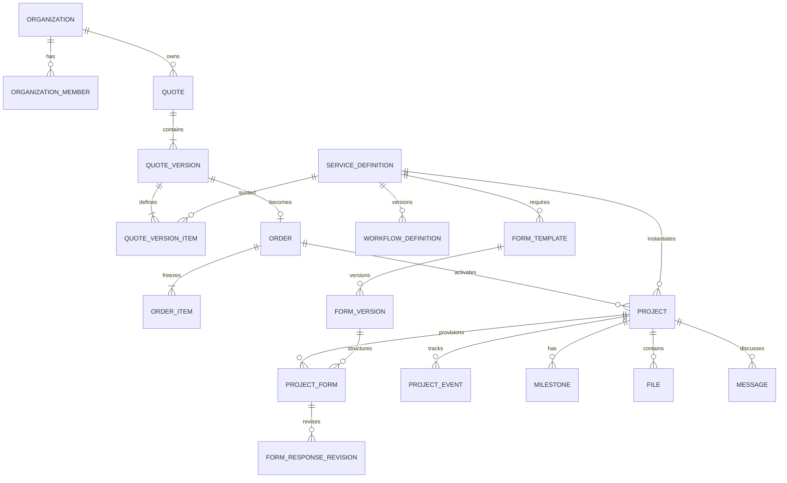

# Modelo de dominio

**Estado:** diseño aprobado; persistencia implementada
**Fecha:** 2026-07-28

## 1. Lenguaje ubicuo

| Término de negocio | Representación de dominio | Persistencia inicial |
|---|---|---|
| Servicio del catálogo | `ServiceDefinition` | `service_catalog` |
| Cotización | `Quote` | `quotes` |
| Versión negociada | `QuoteVersion` | `quote_versions` |
| Orden aceptada | `Order` | `orders` |
| Proyecto contratado | `Project` | `service_instances` |
| Formulario del proyecto | `ProjectForm` | `project_forms` |
| Workflow del servicio | `WorkflowDefinition` | `service_workflow_versions` |
| Revisión de respuestas | `FormResponseRevision` | `form_response_revisions` |

La API y el dominio usarán `Project`. El nombre `service_instances` se conserva como decisión de persistencia compatible con el diseño existente.

## 2. Entidades y responsabilidades

### Identidad y tenancy

- `Profile`: información de presentación del usuario; no contiene permisos técnicos.
- `Organization`: cliente o empresa que posee los recursos.
- `OrganizationMember`: pertenencia, rol, estado y fechas.
- `StaffMember`: autoridad interna global y estado; roles `team` o `admin`.

La autorización cliente se resuelve mediante `organization_members` (`owner|member`) y la autoridad interna mediante `staff_members` (`team|admin`). Nunca se resuelve desde datos enviados por el navegador o `user_metadata` editable.

### Catálogo

- `ServiceDefinition`: nombre, slug, descripción, publicación, configuración y referencias a workflow/formularios.
- `WorkflowDefinition`: estados, transiciones, visibilidad y capabilities requeridas.
- `FormTemplate`: formulario reusable, orden, obligatoriedad y etapa.
- `FormVersion`: definición inmutable del formulario.
- `MilestoneTemplate`: hitos iniciales reutilizables.

El catálogo es reusable. Un proyecto histórico conserva los snapshots/versiones que recibió.

### Comercial

- `Quote`: agregado de la solicitud y estado actual.
- `QuoteVersion`: propuesta inmutable con vigencia, moneda, condiciones y referencia al cliente.
- `QuoteVersionItem`: servicio, cantidad, alcance, importe y snapshot descriptivo.
- `Order`: acuerdo derivado de una versión aceptada.
- `OrderItem`: snapshot de lo que debe activar la orden.
- `Payment`: intento o confirmación externa, separado de la activación.

### Operación

- `Project`: servicio concreto contratado por una organización.
- `ProjectForm`: formulario creado automáticamente para un proyecto.
- `FormResponseRevision`: revisión append-only de respuestas.
- `ProjectEvent`: cambio de estado, progreso o actualización del proyecto.
- `Milestone`: hito operativo del proyecto.
- `File`: metadata y ownership de un archivo privado.
- `Message`: comunicación ligada al proyecto.

### Plataforma

- `AuditEvent`: acción sensible, actor, recurso, resultado y correlation ID.
- `WebhookEvent`: evento externo recibido, validación e idempotencia.
- `OutboxEvent`: efecto externo pendiente de publicar o reintentar.

## 3. Relaciones



La relación crítica de activación es:

```text
OrderItem + unit_number -> exactamente un Project
Project -> exactamente una Organization y un ServiceDefinition
Project -> un WorkflowDefinition fijado
ProjectForm -> exactamente un Project y un FormVersion fijados
```

## 4. Provisionamiento

`ActivateOrder` debe crear, en una transacción corta:

1. Proyectos por ítem/unidad.
2. Workflow fijado y estado inicial.
3. Formularios aplicables y versión publicada.
4. Hitos iniciales.
5. Evento inicial, auditoría y outbox.

La clave idempotente conceptual es `(order_item_id, unit_number)`. Repetir la operación no duplica recursos.

## 5. Flexibilidad controlada

JSONB se permite para:

- definición de formularios;
- respuestas de formularios;
- definición versionada de workflows;
- metadata técnica pequeña.

No se usará JSONB para ownership, permisos, pagos, estados consultados frecuentemente, relaciones o entidades principales. Tampoco se usará EAV ni event sourcing global.
