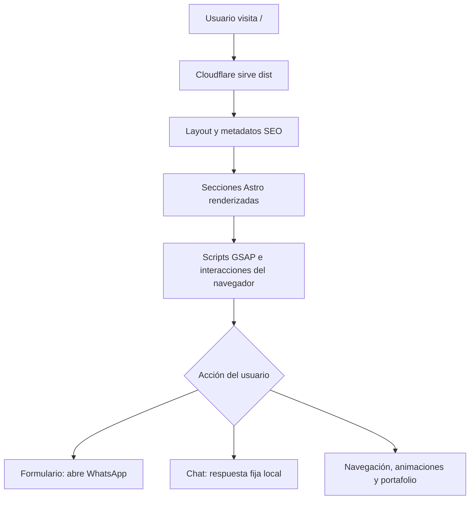
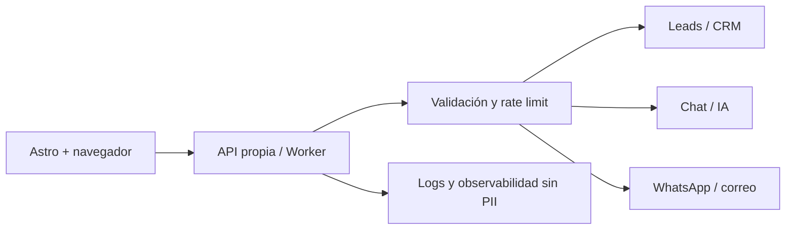

# Informe de análisis inicial — División Digital

**Fecha del análisis:** 24 de julio de 2026
**Alcance:** revisión estática del repositorio, ejecución de validaciones locales, revisión de funcionalidad implementada, rendimiento, accesibilidad, seguridad y preparación para conectar servicios.
**Cambios en la aplicación:** ninguno; este análisis solo agrega documentación en `contexto/`.

## 1. Resumen ejecutivo

El proyecto es una landing page de una sola ruta construida con Astro 6 en modo estático. La aplicación está organizada en componentes Astro independientes y tiene un enfoque visual fuerte: animaciones GSAP, fondo interactivo con canvas, galería de servicios tipo bento, mockup de portafolio, formulario de contacto y widget de chat.

La base actual es adecuada para una presentación comercial estática y el proyecto compila correctamente. Sin embargo, las piezas que parecen “funcionales” en la interfaz todavía son demostrativas:

- El formulario no envía datos a un backend; genera un mensaje y abre WhatsApp desde el navegador.
- El widget de chat no se conecta a una IA, CRM, WhatsApp ni sistema multiagente; responde con texto fijo.
- No hay API, autenticación, persistencia, observabilidad ni validación server-side.

La prioridad antes de conectar servicios debe ser endurecer la superficie de seguridad, eliminar la inserción insegura de texto en el chat, actualizar dependencias auditadas y definir una frontera de API. Después se puede incorporar el backend sin acoplar credenciales ni lógica sensible al navegador.

## 2. Inventario actual

### Stack y configuración

| Área | Estado actual |
|---|---|
| Framework | Astro `6.1.7`, salida `static` |
| Lenguaje | TypeScript con configuración strict de Astro |
| Animación | GSAP `3.15.0`, ScrollTrigger y Flip |
| Procesamiento de imágenes | Sharp `0.34.5` mediante Astro |
| Estilos | CSS global en `src/styles/global.css` y estilos locales en componentes |
| Gestor | pnpm, lockfile presente |
| Runtime declarado | Node `>=22.12.0` |
| Despliegue previsto | Cloudflare Workers Assets apuntando a `dist/` |
| Rutas | Una ruta estática: `/` |
| Backend | No existe actualmente |

### Estructura relevante

```text
src/
├── pages/index.astro              Ensamblaje de la página principal
├── layouts/Layout.astro           HTML base, SEO, fuentes y reveals globales
├── components/
│   ├── InteractiveBackground.astro Canvas de partículas
│   ├── Navbar.astro                Navegación y menú móvil
│   ├── Hero.astro                  Presentación y llamadas a la acción
│   ├── Services.astro              Galería bento animada
│   ├── Showcase.astro              Portafolio y marcas
│   ├── Process.astro               Línea de proceso animada
│   ├── ChatFeature.astro           Demostración visual del chat
│   ├── About.astro                 Misión, visión, valores y confianza
│   ├── Contact.astro               Formulario visual y datos comerciales
│   ├── Footer.astro                Enlaces y redes
│   └── ChatWidget.astro            Widget de chat simulado
├── assets/                         Imágenes procesadas por Astro
└── styles/global.css               Tokens y estilos compartidos
public/                             Logo y favicons
docs/                               Guía existente de despliegue
wrangler.jsonc                      Assets estáticos para Cloudflare
```

## 3. Funcionamiento actual

El flujo de renderizado es estático: Astro compila `src/pages/index.astro`, incorpora sus componentes, optimiza imágenes importadas desde `src/assets` y genera `dist/index.html` junto con los recursos JavaScript, CSS y WebP.



### Secciones y comportamiento

- **Navbar:** navegación por anclas, cambio visual al hacer scroll, menú móvil animado y seguimiento de sección activa.
- **Hero:** CTA hacia servicios y contacto, métricas visuales y animaciones de entrada/fondos.
- **Services:** 20 tarjetas visuales; en escritorio cuatro tarjetas expansibles se alternan con GSAP Flip; en móvil se usa un efecto de tarjetas apiladas.
- **Showcase:** mockup visual, carrusel de marcas y enlaces externos a portafolios reales.
- **Process:** timeline visual con animación cíclica activada al entrar en viewport.
- **ChatFeature:** demostración de una conversación; el campo está deshabilitado y no es un chat real.
- **About:** contenido estático de misión, visión, valores e indicadores de confianza.
- **Contact:** valida requisitos HTML del navegador, arma un texto y abre un enlace de WhatsApp con los datos del formulario.
- **ChatWidget:** panel flotante, acciones rápidas, mensajes locales y una respuesta fija tras un segundo.
- **InteractiveBackground:** 90 partículas en escritorio y aproximadamente 45 en móvil, conexiones entre partículas y respuesta al cursor.

Los scripts tienen lógica de limpieza para eventos, observers, timers y tweens, lo cual es positivo si más adelante se usan transiciones de página de Astro.

## 4. Validaciones realizadas

| Validación | Resultado |
|---|---|
| `pnpm exec astro check` | Correcto: 0 errores, 0 advertencias, 0 avisos en 15 archivos |
| `pnpm run build` | Correcto: 1 página estática construida en aproximadamente 3.7 s |
| Auditoría `pnpm audit --prod --json` | Reportó 13 vulnerabilidades high, 6 moderate y 3 low en el árbol instalado |
| Estado Git inicial | Rama `master` alineada con `origin/master`; ya existía `.codex-sandbox/` sin seguimiento |

El primer build ejecutado en paralelo con el chequeo de tipos falló por un `EPERM` al renombrar una carpeta temporal de Vite dentro de `node_modules`. Al repetir las tareas de forma secuencial, el chequeo y el build terminaron correctamente. Esto no se considera un fallo reproducible del código, pero sí es una advertencia útil para pipelines que ejecuten procesos de Astro simultáneamente sobre el mismo directorio.

## 5. Rendimiento

### Situación medida

El build generado ocupa aproximadamente **1.47 MB** distribuidos en 43 archivos:

- HTML: aproximadamente 69.7 KB.
- JavaScript: aproximadamente 151.8 KB.
- CSS: aproximadamente 48.9 KB.
- Imágenes optimizadas: aproximadamente 1.23 MB.

Astro ya está transformando las imágenes importadas a WebP y aplica `loading="lazy"` en las tarjetas de servicios. Esta es una buena base: el peso entregado es mucho menor que el de los archivos originales.

### Oportunidades de mejora

1. **Reducir los assets fuente.** Hay 20 PNG de servicios que suman aproximadamente 25.8 MB en `src/assets`; conviene conservar originales fuera del bundle o convertirlos a WebP/AVIF optimizados con dimensiones reales de uso.
2. **Controlar el canvas en pantallas de alta densidad.** El canvas usa `devicePixelRatio` sin límite. En dispositivos 3x o 4x puede aumentar el costo de dibujo; conviene limitarlo, por ejemplo, a 2, y ajustar la cantidad de partículas según viewport y capacidad.
3. **Reducir trabajo por frame.** Las conexiones calculan todas las parejas de partículas, una complejidad O(n²). Con 90 partículas es aceptable, pero un grid espacial o una distancia máxima precalculada sería más seguro si la interacción crece.
4. **Centralizar animaciones.** Varias secciones importan y registran GSAP por separado. El bundle actual es razonable, pero conviene mantener una política de carga y medir Core Web Vitals antes de agregar más efectos.
5. **Evitar animación innecesaria.** El fondo ya pausa con pestaña oculta y `prefers-reduced-motion`; conviene aplicar la misma disciplina a cualquier futura integración de chat, métricas o polling.
6. **Medir en navegador real.** Falta una línea base de Lighthouse/WebPageTest con móvil, conexión lenta, CPU limitada y `prefers-reduced-motion`. El peso del build por sí solo no permite garantizar LCP, INP o CLS.

## 6. Seguridad

### Hallazgos prioritarios

#### Alto — texto del chat insertado con `innerHTML`

En `src/components/ChatWidget.astro`, el texto escrito por el usuario se inserta como HTML:

```ts
userMsg.innerHTML = `<p>${text}</p>`;
```

Aunque hoy el chat no persiste ni envía el mensaje, esto permite inyección de HTML/JS en el navegador si se introduce contenido malicioso. Debe reemplazarse por creación de elementos y `textContent`, o por una sanitización confiable. La respuesta del backend también debe tratarse como texto no confiable; no se debe resolver solo en el frontend.

#### Alto — dependencias con alertas de seguridad

La auditoría local reportó vulnerabilidades en el árbol instalado, entre ellas:

- `astro@6.1.7` con varias alertas de XSS/SSRF y replay según los avisos del audit.
- `sharp@0.34.5` con alertas heredadas de libvips.
- Versiones transitivas de `vite`, `postcss`, `fast-uri`, `yaml`, `js-yaml`, `devalue` y `svgo`.

Antes de producción se debe actualizar el lockfile a versiones corregidas, revisar cambios incompatibles y volver a ejecutar `astro check`, `build` y una prueba funcional. Como `sharp`, Astro, TypeScript y `@astrojs/check` son principalmente herramientas de build en este sitio estático, también conviene clasificar correctamente las dependencias de runtime frente a `devDependencies`.

#### Alto — ausencia de backend seguro para datos de contacto

El formulario no tiene `action` ni endpoint. Los datos se serializan en un URL de WhatsApp desde el navegador, por lo que no existe validación server-side, control anti-spam, rate limiting, auditoría, reintentos ni garantía de entrega. Al conectar servicios, no deben exponerse API keys, tokens de CRM, credenciales de IA ni secretos de WhatsApp en el cliente.

#### Medio — políticas HTTP no definidas

`wrangler.jsonc` solo configura assets. No se observa una política de seguridad de contenidos ni headers explícitos de seguridad. Para producción conviene definir, probar y desplegar como mínimo una estrategia para CSP, `X-Content-Type-Options`, `Referrer-Policy`, `Permissions-Policy`, protección contra framing y HSTS cuando el dominio esté listo. La CSP requerirá revisar los scripts/estilos inline y la carga de Google Fonts.

#### Medio — enlaces externos con `target="_blank"`

Los enlaces del portafolio ya usan `rel="noopener noreferrer"`, pero varios enlaces sociales de `Contact.astro` y `Footer.astro` no lo hacen. Deben uniformarse para evitar que una página externa reciba `window.opener`.

### Recomendaciones adicionales

- Validar y limitar longitud/formato de todos los campos en backend; rechazar contenido inesperado.
- Añadir honeypot o proveedor anti-spam y rate limiting por IP/identificador antes de enviar a CRM o WhatsApp.
- Registrar errores sin guardar mensajes completos ni datos personales innecesarios.
- Usar `.dev.vars`/secrets de Wrangler solo para desarrollo y despliegue; nunca versionar secretos.
- Definir CORS con una lista explícita de orígenes, no con `*`, cuando existan endpoints.
- Usar timeouts, límites de reintento e idempotencia en integraciones externas.

## 7. Accesibilidad y calidad de interfaz

### Aspectos positivos

- Hay `lang="es"`, viewport y textos alternativos en logos/imágenes principales.
- Se usan elementos semánticos como `nav`, `section`, `form`, `button` y encabezados.
- El menú y el widget exponen parte de su estado con `aria-expanded` y `aria-hidden`.
- Se respeta `prefers-reduced-motion` en las piezas animadas más costosas.

### Mejoras necesarias

- Agregar `aria-controls` al botón del menú y al botón del chat.
- Gestionar foco al abrir/cerrar menú y chat; en móvil conviene un focus trap dentro del panel.
- Añadir un nombre accesible al input del widget (`label` visible u `aria-label`) y `aria-live="polite"` al área de mensajes.
- Añadir `role="dialog"`, nombre accesible y relación con el overlay al panel de chat.
- Verificar contraste, tamaño de texto y navegación completa por teclado con Lighthouse/axe.
- Revisar el estado “activo” de navegación cuando el usuario llega directamente a una sección o usa el historial del navegador.
- Asegurar que los elementos que solo parecen tarjetas clicables tengan semántica de botón o enlace; actualmente las tarjetas de servicios se hacen clicables con CSS/JavaScript.

## 8. Mantenibilidad y arquitectura

La separación por componentes es clara y apropiada para la landing. El principal punto de deuda técnica es que cada componente contiene simultáneamente markup, estilos y scripts de interacción. Esto es válido para una página pequeña, pero se volverá costoso al agregar servicios.

Recomendaciones:

1. Centralizar tipos, constantes de negocio y URLs en módulos de `src/lib` o `src/config`.
2. Extraer datos de servicios, marcas y enlaces a archivos tipados en vez de mantenerlos mezclados con el markup.
3. Evitar selectores globales ambiguos como `.mobile-link`, `.quick-btn` o `.dense-bento-grid` si se agregan más instancias.
4. Sustituir `any` en el manejo de GSAP Flip por el tipo más específico posible.
5. Añadir scripts explícitos para `check`, lint, formato y pruebas.
6. Incorporar CI que instale con `pnpm install --frozen-lockfile`, ejecute auditoría, chequeo de tipos, build y pruebas de accesibilidad.
7. Mantener separadas las dependencias de build y las que realmente deben descargarse en runtime.

## 9. Preparación recomendada para conectar servicios

La aplicación debería conservar una frontera clara entre UI y backend:



### Primera API sugerida

- `POST /api/leads`: recibe nombre, correo, empresa, servicio y mensaje.
- `POST /api/chat/messages`: recibe una conversación con un identificador temporal y el mensaje actual.
- `GET /api/health`: health check sin información sensible.

Cada endpoint debería tener esquema de entrada, límites de tamaño, respuestas consistentes, códigos HTTP claros y una política de errores que no revele secretos ni trazas internas.

### Evolución de infraestructura

1. Mantener la landing estática mientras el backend se incorpora como Worker o servicio separado.
2. Guardar secrets en Cloudflare Wrangler, nunca en Astro ni en `public/`.
3. Usar una capa de adaptadores para CRM, IA, WhatsApp y correo; la UI no debe conocer proveedores concretos.
4. Definir si se necesita persistencia: D1 para datos relacionales, KV para datos simples/cacheados y Durable Objects si se requiere estado coordinado por conversación.
5. Añadir autenticación solo a los paneles internos o APIs administrativas; el formulario público debe protegerse con controles de abuso, no con secretos expuestos.
6. Implementar observabilidad antes de escalar: latencia, errores, tasa de envío, respuestas de proveedor y límites de uso.

## 10. Plan de mejora priorizado

### Fase 0 — Línea base y seguridad

- Actualizar dependencias auditadas y revisar el lockfile.
- Corregir `innerHTML` del chat y normalizar `rel` en enlaces externos.
- Añadir scripts de check/build reproducibles y CI.
- Definir headers de seguridad y revisar CSP.

### Fase 1 — Contacto real

- Crear `POST /api/leads` en un Worker.
- Validar, limitar y registrar el lead de forma segura.
- Integrar CRM/correo/WhatsApp mediante adaptadores y secrets.
- Añadir estados de envío, error, reintento y accesibilidad al formulario.

### Fase 2 — Chat real

- Definir contrato de conversación y proveedor de IA.
- Mover generación de respuestas al backend.
- Añadir rate limiting, límites de tokens, moderación y trazabilidad por conversación.
- Mantener una respuesta de fallback cuando el proveedor no esté disponible.

### Fase 3 — Rendimiento y calidad

- Medir Core Web Vitals en móvil.
- Comprimir/convertir assets fuente y limitar DPR del canvas.
- Auditar foco, contraste y teclado con axe/Lighthouse.
- Añadir pruebas de humo para formulario, navegación, chat y build.

## 11. Conclusión

La base actual está bien encaminada para una landing estática: es modular, compila, optimiza imágenes y ya contempla limpieza de animaciones y reducción de movimiento. El proyecto todavía no debe considerarse una aplicación conectada a servicios porque no tiene backend ni persistencia.

El siguiente cambio técnico más importante no es agregar más UI, sino establecer el límite seguro entre el navegador y los servicios. Con esa frontera, validación server-side, dependencias actualizadas y una primera batería de pruebas, la landing podrá evolucionar hacia CRM, WhatsApp, correo o IA sin trasladar riesgos ni credenciales al cliente.
